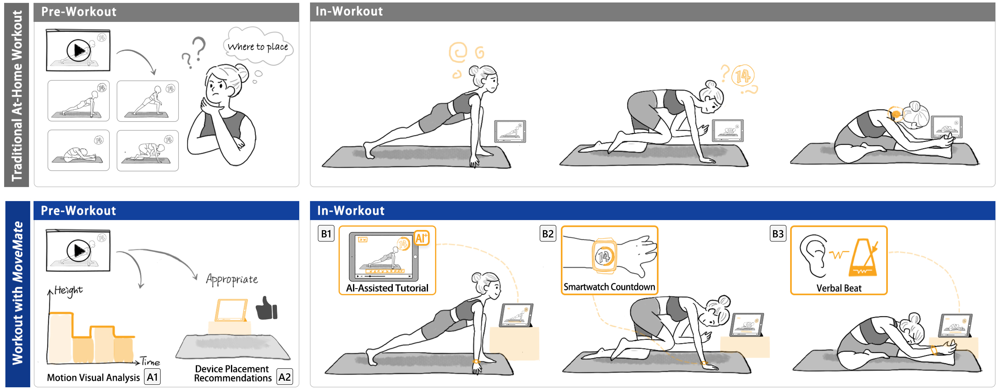

# 🏃‍♀️‍➡️ MoveMate

Code for the paper **MoveMate: Supporting Video-Guided Workouts through Motion Visual Analysis and Multi-Device Guidance**.

Online workout videos often switch between prone, supine, and standing postures, so a screen placed in one fixed spot is hard to see during parts of the workout. MoveMate is a multi-device workout support system that:

- **Before the workout**: analyzes the instructional video, visualizes how the instructor's face orientation and eye height change over time, and recommends where to place playback devices.
- **During the workout**: gives extra visual and auditory guidance so users can keep following the movements in any body posture.

A user study (N=24) showed that MoveMate made it easier for users to follow the instructor when the screen was hard to see.



## Repository Structure

```
MoveMate/
├── app.py              # Flask server + video analysis pipeline
├── templates/
│   ├── index.html      # Landing page
│   ├── upload.html     # Video upload page
│   └── analysis.html   # Analysis results & device placement recommendations
├── static/
│   ├── analysis.js     # Frontend logic for the analysis page
│   └── images/         # UI assets, 3D placement models (.glb), example figures
├── requirements.txt
└── .render.yaml        # Render deployment config
```

## Video Analysis Pipeline

`app.py` uses [MediaPipe Pose](https://developers.google.com/mediapipe) to extract the instructor's landmarks frame by frame, then:

1. Estimates **body orientation** (e.g., facing up / down / neutral), **body height**, and **head (eye) height** for each frame.
2. Smooths the sequences and splits the video into posture segments. This step uses change-point detection with `ruptures` and merges or filters short, alternating, or invalid segments.
3. Finds periodic head-height movement in each segment (ACF + peak detection, FFT amplitude) to further refine the segments.
4. Plots the head-height/orientation timeline and an orientation summary chart (saved to `static/results/`), which are shown on the analysis page along with device placement recommendations.

The analysis starts in a background thread after a video is uploaded; the analysis page polls `/check_status` until the results are ready.

## Getting Started

Requires Python 3.8–3.10 (the pinned versions in `requirements.txt`, e.g. `numpy==1.24.4`, do not support newer Python).

```bash
git clone https://github.com/yihanliux/MoveMate.git
cd MoveMate
pip install -r requirements.txt
```

Run locally:

```bash
flask --app app run
```

Then open http://127.0.0.1:5000. Uploaded videos are saved to `static/uploads/`, and analysis outputs to `static/results/`.

For deployment (e.g., on Render), the app is served with:

```bash
gunicorn app:app
```

> **Note:** Analysis state is kept in memory, so run a single worker process (the gunicorn default).

## Citation

If you find this work useful, please cite our paper:

```bibtex
@inproceedings{movemate,
  title     = {MoveMate: Supporting Video-Guided Workouts through Motion Visual Analysis and Multi-Device Guidance},
  author    = {Yihan Liu and Anqi Xie and Shuheng Hu and Yong Yue and Yu Liu},
  booktitle = {ACM International Conference on Mobile Human-Computer Interaction},
  year      = {2026}
}
```
